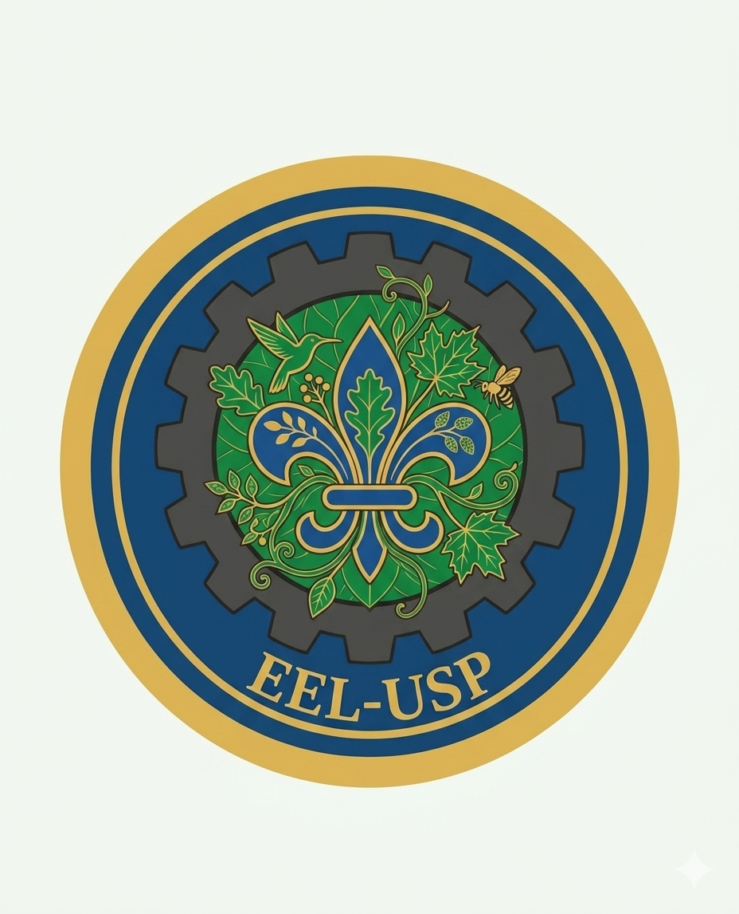

# Tecnologias Limpas • USP EEL

# 🌱 Tecnologias Limpas • USP EEL

<p align="center">
  
</p>

<p align="center">
  <b>Tecnologia • Sustentabilidade • Impacto Social</b>
</p>

---

## 📖 Sobre o Projeto

O **Tecnologias Limpas** é uma plataforma desenvolvida por estudantes da **Escola de Engenharia de Lorena (EEL-USP)** para a disciplina de **Tecnologias Limpas**, com o objetivo de promover soluções sustentáveis, acessíveis e de baixo custo para residências e comunidades.

O projeto reúne iniciativas voltadas à eficiência energética, reaproveitamento de recursos, educação ambiental e desenvolvimento tecnológico, disponibilizando gratuitamente materiais, tutoriais e vídeos para incentivar a adoção de práticas mais sustentáveis.

Além dos projetos físicos, a plataforma também divulga iniciativas digitais desenvolvidas por estudantes da EEL-USP, fortalecendo a integração entre tecnologia, sustentabilidade e impacto social.

---

## 🌎 Objetivos

- Incentivar hábitos sustentáveis no cotidiano;
- Desenvolver tecnologias de baixo custo para residências;
- Promover educação ambiental por meio de conteúdos acessíveis;
- Integrar engenharia, inovação e sustentabilidade;
- Compartilhar conhecimento de forma gratuita para a comunidade.

---

# 🚀 Projetos Desenvolvidos

## 💡 Lâmpada Inteligente

Sistema automático que ajusta a intensidade da iluminação de acordo com a luz ambiente, proporcionando economia de energia elétrica.

---

## 💧 Sistema de Reaproveitamento de Água

Projeto destinado ao reaproveitamento da água proveniente da máquina de lavar roupas utilizando galões reutilizados e escoamento por gravidade.

---

## 🪟 Painel de Isolamento Térmico

Painel removível confeccionado com papelão reciclado e manta térmica aluminizada para reduzir a entrada de calor em portas e janelas.

---

## 🔆 Sistema Autônomo de Iluminação para Ambientes Externos

Projeto colaborativo de iluminação alimentada por energia solar fotovoltaica, utilizando sensor de movimento PIR para reduzir o consumo energético.

---

## 📱 Green Rats

Aplicativo desenvolvido para incentivar hábitos sustentáveis através da estimativa das emissões de CO₂ evitadas, utilizando gamificação para conscientização ambiental.

---

## ♻️ Ponto Verde

Website desenvolvido para facilitar o descarte correto de resíduos, reunindo pontos de coleta e utilizando Inteligência Artificial para orientar a população sobre o descarte adequado.

---

# 🎥 Canal Casa Sustentável

Além do website, o projeto conta com um canal no YouTube contendo tutoriais completos dos projetos desenvolvidos.

🔗 https://youtube.com/@casasustentaveel

---

# 🌐 Acesse o Site

> Coloque aqui o link do GitHub Pages depois de publicado.

Exemplo:

```
https://SEUUSUARIO.github.io/tecnologias-limpas/
```

---

# 🛠️ Tecnologias Utilizadas

- HTML5
- CSS3
- JavaScript
- GitHub Pages
- YouTube
- Autodesk Fusion (modelagem 3D)

---

# 🌍 Objetivos de Desenvolvimento Sustentável (ODS)

Este projeto contribui diretamente para os seguintes Objetivos de Desenvolvimento Sustentável da ONU:

- 💧 ODS 6 — Água Potável e Saneamento
- ⚡ ODS 7 — Energia Limpa e Acessível
- 🏙️ ODS 11 — Cidades e Comunidades Sustentáveis
- ♻️ ODS 12 — Consumo e Produção Responsáveis
- 🌎 ODS 13 — Ação Contra a Mudança Global do Clima

---

# 👨‍💻 Equipe

Projeto desenvolvido por estudantes da **Escola de Engenharia de Lorena (USP EEL)**.

> Adicione aqui os nomes dos integrantes e seus respectivos e-mails institucionais.

---

# 📄 Licença

Este projeto foi desenvolvido para fins acadêmicos na disciplina de **Tecnologias Limpas** da **Escola de Engenharia de Lorena (USP)**.

---

<p align="center">

🌱 **Tecnologias Limpas • USP EEL**

*"Pequenas ações sustentáveis podem gerar grandes impactos para o futuro."*

</p>
